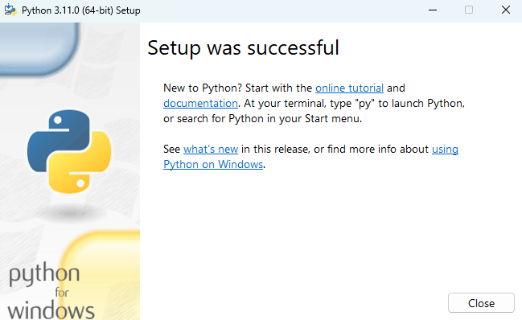
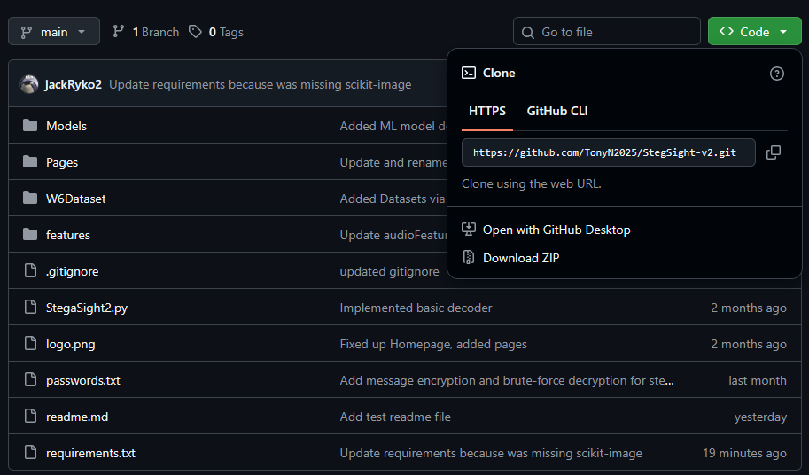
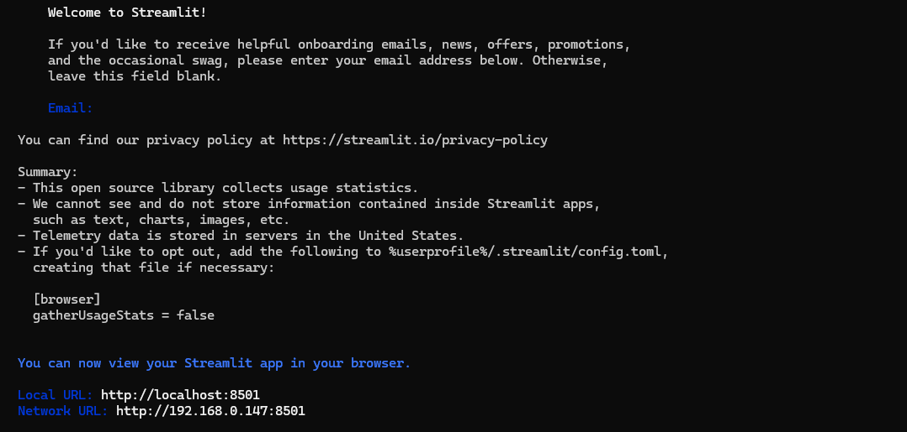

# StegaSight


StegaSight is a web-based steganalysis tool. It was developed to identify hidden content in digital documents. To bypass standard security measures and hide scripts or exfiltrate data using images and other media, cybercriminals usually employ steganography. StegaSight uses digital signal processing (DSP) and machine learning (ML) to detect statistical and frequency-based abnormalities that reveal hidden content. The system uses datasets comparable to ALASKA2, produced using tailored encoding and decoding methods, and can detect scripts concealed within image files. StegaSight, developed in Python and Streamlit, generates interpretable visual outputs, such as spectrograms, to facilitate forensic analysis.
# Installation
StegaSight is a web-based application written in Python and using the Streamlit framework. To install, first install Python, then use Pip to install all requirements. Streamlit will be installed as part of the package requirements. Once installed, run by calling the Streamlit executable with the mail boot system root file “StegaSight2.py” as the primary parameter. Once started, the system can be accessed via a browser. 

All commands shown are for Windows installation; they can be easily adapted to Linux if required.  
 

## Python installation
StegaSight requires Python 3.11 (Stable). To install Python, download the appropriate installer from:

[https://www.python.org/downloads/release/python-3110/](https://www.python.org/downloads/release/python-3110/)

The Windows installer can be downloaded from:

[**https://www.python.org/ftp/python/3.11.0/python-3.11.0-amd64.exe**](https://www.python.org/ftp/python/3.11.0/python-3.11.0-amd64.exe)

Run the Python installer and follow the instructions.



## Create a master level folder.
It is recommended that you create a root-level directory or folder to contain the Stegasight application. 

```
> mkdir StegaSight  
```

## Get the StegaSight codebase from GitHub.
To get the code for the StegaSight codebase, follow the link below.

[https://github.com/TonyN2025/StegSight-v2](https://github.com/TonyN2025/StegSight-v2)

Download via the “Code” button and click “Download ZIP”



This will download the codebase as a zip file. Download the zip file into the root-level folder created earlier, then extract it under the root-level directory. Either use the extract utility (which will automatically create a subfolder named StegSight-v2-main) or use the following commands.

```  
> mkdir StegSight-v2-main  
> tar \-xf StegSight-v2-main.zip \-C ./StegSight-v2-main  
```

## Create a Python Virtual environment.
It is recommended that you use a Python virtual environment to run the Stegasight application. This will avoid conflicts with other Python environments and libraries. It will also keep the application and all dependent files in one location. 

Open a command prompt / Terminal. Navigate to the root-level environment created earlier, then navigate down one level into the StegSight-v2-main directory.  Create the virtual environment; the virtual environment files will be created in the current location when the following commands are run. 

```  
cd StegSight-v2-main  
py \-3.11 \-m venv stegsight\_env  
```

The first three levels should be as follows.

```  
STEGASIGHT  
└───StegSight-v2-main  
    ├───StegSight-v2-main  
    │   ├───features  
    │   ├───Models  
    │   ├───Pages  
    │   └───W6Dataset  
    │       ├───Clean  
    │       └───Stego  
    └───stegsight\_env  
        ├───Include  
        ├───Lib  
        │   └───site-packages  
        │       ├───pip  
				...  
        │       ├───pkg\_resources  
				...  
        │       ├───setuptools  
				...  
        │       ├───setuptools-65.5.0.dist-info  
				...  
        │       └───\_distutils\_hack  
				...  
        └───Scripts  
```

Activate the virtual environment. 

```
stegsight\_env\\Scripts\\activate.bat  
```

The prompt should now be preceded by “(stegsight\_env)”

To exit or deactivate the Python virtual environment, you may use “deactivate”

```
deactivate  
```

## Install Application dependencies 

Install all required dependencies using Pip and the requirements file. 

``` 
cd StegSight-v2-main  
pip install \-r requirements.txt  
```

This may take a few minutes to complete, as some of the requirements are large. 

# Running StegaSight

Run Steamlit from the directory containing the StegaSight2.py file.

``` 
> streamlit run StegaSight2.py  
```

If asked for an email address, press Enter to leave it blank.

Once completed, a browser showing StegaSight should open automatically. If not, open a Browser and navigate to the address indicated on the command screen.

 You can now view your Streamlit app in your browser.

  Local URL: http://localhost:8501  
  Network URL: http://192.168.0.147:8501



# StegaSight Application Pages

The StegaSight application has the following pages.

## StegaSight2

Main landing page

## Encode

The Encode page allows you to encode or hide a text message within an image. To select an image, use the browse button to choose one from your local machine. Enter the text to be hidden in the “Enter a secret message to hide” text box. Optionally add a password in the “Enter a password to encrypt the message (optional)” text box. Press enter, and the original image, along with the encoded image, will be displayed. There should be an option to download the encoded image at the bottom of the page.

## Decode

The decode page lets you decode hidden messages in images. To select an image, use the browse button to choose one from your local machine. If a password was used, enter the password in the “Enter password” text box. After pressing Enter, it should display the image, the hidden message, and the image's pixel values.

## Image Encode

The image encode page lets you hide images within images. Simply select images for both the “Upload cover image” and “Upload image to be hidden”. Then it should display both uploaded images. Below the images, the result of the algorithm should appear, with a slider to adjust how many bits it overwrites. There should be an option to download the encoded image at the bottom of the page.

## Image Decode

The image-decode page lets you extract hidden images from within other images. Upload the image you wish to extract the secret image from, then use the slider to select the number of bits you want the algorithm to use for extracting that image. The result of the extraction will be shown below the slider.

## Decode ML model

This page performs the same functionality as the decode page, but uses a machine learning model to determine whether the image contains a hidden message. Simply upload the image to the page, and it will sort the images into one of two categories: “Clean” or “Hidden”. It will then display the hidden message below the bottom of the two columns.

## Audio Decode(Final)

This allows you to decode text hidden within an audio file. First, upload the audio file and adjust any settings as needed. Then hit Enter, and it should say “Hidden message successfully decoded\!” and give you the option to preview or download it. 

## Audio Encode(Final)

This allows you to hide text inside a specified audio file. First, upload an audio file, then type the text you wish to hide in the box below “Enter the text message to hide”. After that, hit Enter, and it should give you the option to preview the audio. Below that, there should be a download button that gives you the encoded audio file.

## Image Audio 

This module allows you to hide an image within an audio file, extract the hidden image from the audio file, and detect any potential hidden image within the uploaded audio file. To use the encode function, upload an image and an audio file, then press encode, and it should resize the image if needed. It will then give you a visualisation of the audio as a spectrogram, along with a download below it.

The detect option lets you identify any image hidden within an audio file. Upload any audio file and press the “Detect” button, and it should perform a check to see if any image is contained within the uploaded audio file. 

The decode option lets you extract hidden images from audio files. Upload the audio you wish to extract the image from. Then press the “Decode” button, and it should show the extracted image along with a visualisation of the audio in spectrogram format.  
